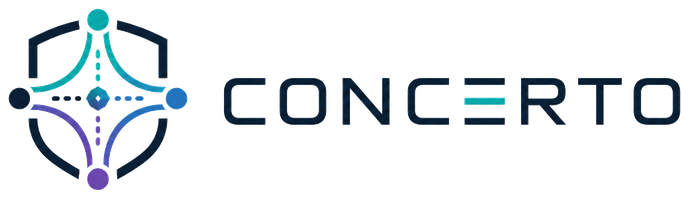
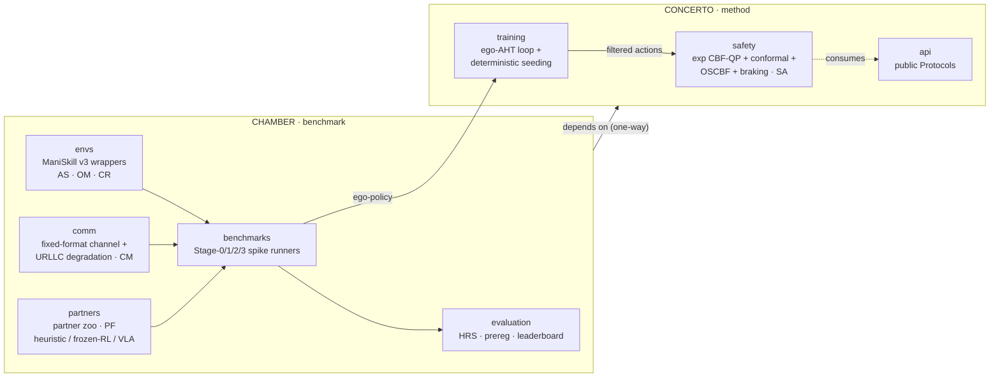

<p align="center">
  <a href="https://github.com/fsafaei/concerto">
    <picture>
      <source media="(prefers-color-scheme: dark)" srcset="docs/assets/dark_mode.png">
      
    </picture>
  </a>
</p>

<p align="center">
  <em>Contact-rich coordination with opaque, heterogeneous teammates &mdash;
  with explicit safety assumptions and conformal-CBF reporting.</em><br/>
  <strong>CONCERTO</strong> is the method.
  <strong>CHAMBER</strong> is the benchmark.
  We evaluate CONCERTO on CHAMBER.
</p>

<p align="center">
  <a href="https://doi.org/10.5281/zenodo.20128469">
    </a>
  <a href="https://github.com/fsafaei/concerto/actions/workflows/ci.yml">
    </a>
  <a href="https://fsafaei.github.io/concerto/">
    </a>
  <!-- Replace with the real arXiv badge when the design-report preprint is on arXiv. -->
  <!-- <a href="https://arxiv.org/abs/XXXX.XXXXX">
    </a> -->
  <a href="LICENSE">
    </a>
  <a href="https://scorecard.dev/viewer/?uri=github.com/fsafaei/concerto">
    </a>
  <a href="https://pypi.org/project/concerto/">
    </a>
  
</p>

> **Status &mdash; pre-release, Phase&nbsp;0.** Architecture is
> locked in 15 ADRs (13 Accepted, 2 RFC) under the working policy
> recorded in [`adr/ADR-INDEX.md`](adr/ADR-INDEX.md); the staged
> Phase-0 spike protocol
> ([ADR-007](adr/ADR-007-heterogeneity-axis-selection.md)) is the
> validation gate that promotes Accepted ADRs to **Validated** with
> per-axis &#8805;20&nbsp;pp evidence. The Stage-1 (AS&nbsp;+&nbsp;OM)
> preregistrations are the next launch; the leaderboard fills with
> M5. The public API is on `0.x` &mdash; MINOR bumps may break it
> per SemVer&nbsp;&sect;4. See [Roadmap](#roadmap).

**TL;DR.** CONCERTO is a three-layer safety stack &mdash; exponential
CBF&#x2011;QP, conformal-slack overlay, OSCBF inner filter, hard
braking fallback &mdash; for robots that must work with **opaque,
heterogeneous** teammates they were **never trained with**. CHAMBER is
the matching benchmark &mdash; six heterogeneity sub-axes above
ManiSkill&nbsp;v3, fixed-format communication with URLLC-anchored
degradation profiles, a partner zoo, and an ISO&nbsp;10218-2:2025-aware
safety-reporting format. Open from day one, ADR-tracked design
contract, preregistered spikes, byte-identical CPU determinism via
`uv.lock` + a `root_seed`.

<details>
<summary><strong>Table of contents</strong></summary>

- [Quickstart](#quickstart)
- [Architecture at a glance](#architecture-at-a-glance)
- [Why this exists](#why-this-exists)
- [The six heterogeneity axes CHAMBER measures](#the-six-heterogeneity-axes-chamber-measures)
- [Repository layout](#repository-layout)
- [Leaderboard](#leaderboard)
- [Who this is for](#who-this-is-for)
- [Documentation](#documentation)
- [Roadmap](#roadmap)
- [FAQ](#faq)
- [Non-goals](#non-goals)
- [Contributing](#contributing)
- [Stability & versioning](#stability--versioning)
- [Citing CONCERTO & CHAMBER](#citing-concerto--chamber)
- [Acknowledgments](#acknowledgments)
- [License](#license)

</details>

---

## Quickstart

<sub>30-second smoke test.</sub>

```bash
git clone https://github.com/fsafaei/concerto.git
cd concerto
pip install uv && uv sync --group dev

# Smoke test the rig (ADR-001 acceptance criterion).
uv run pytest -m smoke -x -v
```

Compose a factory-floor channel (URLLC-anchored degradation profile
from ADR-006) and round-trip a packet through `encode` &rarr; `decode`:

```python
from chamber.comm import (
    CommDegradationWrapper,
    FixedFormatCommChannel,
    URLLC_3GPP_R17,
)

channel = CommDegradationWrapper(
    FixedFormatCommChannel(),
    URLLC_3GPP_R17["factory"],
    tick_period_ms=1.0,
    root_seed=0,
)

state = {
    "pose": {
        "ego": {"xyz": (0.0, 0.0, 0.0), "quat_wxyz": (1.0, 0.0, 0.0, 0.0)},
    },
    "task_state": {"ego": {"grasp_side": "left"}},
}

# The factory profile delays each packet by ~5 ticks; drain the queue so
# the visible packet carries the freshly-encoded state.
for _ in range(10):
    packet = channel.encode(state)
decoded = channel.decode(packet)
print("decoded payload:", decoded)
```

Save the snippet to `quickstart.py` and run `uv run python quickstart.py`.

The six pre-registered URLLC profiles &mdash; `ideal`, `urllc`,
`factory`, `wifi`, `lossy`, `saturation` &mdash; are the Stage&#x2011;2
CM sweep table. See
[`docs/how-to/run-spike.md`](docs/how-to/run-spike.md) for the full
flow. For the bigger picture, jump to
[Architecture at a glance](#architecture-at-a-glance).

---

## Architecture at a glance

Two top-level packages, one wheel. CHAMBER (benchmark) wraps
ManiSkill&nbsp;v3 and provides the six heterogeneity axes, the
communication stack, the partner zoo, and the evaluation harness.
CONCERTO (method) provides the safety stack and the ego-AHT training
loop. Dependency direction is one-way: `chamber → concerto`.



The six axis labels in parentheses tie each module to the
heterogeneity sub-axis it exercises; see
[the six heterogeneity axes](#the-six-heterogeneity-axes-chamber-measures)
for the per-axis pre-registered &#8805;20&nbsp;pp gap rule.

---

## Why this exists

Real factories already pair robots that were never trained together.
A 500&nbsp;Hz industrial arm next to a 50&nbsp;Hz mobile base; a
vision-only manipulator next to a force-feedback one; a vendor&#x2011;A
controller next to a vendor&#x2011;B controller under binding
**ISO&nbsp;10218-2:2025**. At deployment time, your robot's teammate
is **opaque** (no policy access), **heterogeneous** (different
morphology and action frequency), and **ad&nbsp;hoc** (no prior joint
training). Hospitals and warehouses are the same picture.

Most multi-robot benchmarks assume identical embodiments and shared
training. The few that don't focus on planning or navigation, not on
contact-rich physical manipulation. The intersection of
**Heterogeneity &times; Black-box partner &times; Safety &times; Manipulation** is
empty in the published literature. CHAMBER is built to fill it, and
CONCERTO is the first method designed against this four-aspect
contract; empirical validation is staged through CHAMBER spikes
(Stage&nbsp;1&nbsp;&rarr;&nbsp;Stage&nbsp;3) per
[ADR-007 &sect;Decision](adr/ADR-007-heterogeneity-axis-selection.md#decision).

### How we sit relative to the closest prior work

Every prior precedent covers at most three of the four aspects. The
table below lists the closest precedent for each pair of aspects; no
published row hits all four. Click any precedent to open the paper.

| Method | Heterogeneous | Black-box partner | Safety bound | Contact-rich manipulation |
|---|:---:|:---:|:---:|:---:|
| [Liu 2024 RSS (LLM&#x2011;AHT)](https://arxiv.org/abs/2406.12224)                            | &#10003; | &#10003; |          |          |
| [COHERENT (LLM&#x2011;MR planning)](https://arxiv.org/abs/2409.15146)                        | &#10003; | &#10003; |          |          |
| [Huriot &amp; Sibai 2025 (conformal CBF)](https://arxiv.org/abs/2409.18862)                  |          | &#10003; | &#10003; |          |
| [HetGPPO](https://arxiv.org/abs/2301.07137) &nbsp;/ [HARL](https://jmlr.org/papers/v25/23-0488.html) (heterogeneous MARL) | &#10003; |          |          |          |
| [Wang et al. 2017 (multi&#x2011;robot CBFs)](https://ieeexplore.ieee.org/document/7989121)   | &#10003; |          | &#10003; |          |
| [RoCoBench (multi&#x2011;robot manipulation)](https://arxiv.org/abs/2307.04738)              | &#10003; |          |          | &#10003; |
| [SafeBimanual (safe bimanual manip.)](https://arxiv.org/abs/2508.18268)                      |          |          | &#10003; | &#10003; |
| **CONCERTO + CHAMBER**                                                                       | **&#10003;** | **&#10003;** | **&#10003;** | **&#10003;** |

**Reading the table.** *Heterogeneous* here is the four-aspect
literature-gap level; CHAMBER's six measurable sub-axes (AS, OM, CR,
CM, PF, SA) decompose it further per
[ADR-007](adr/ADR-007-heterogeneity-axis-selection.md).

Read the table by columns to see what each aspect covers in isolation,
and by rows to see what no single line of work has yet combined.
Contact-rich manipulation appears with multi-robot coordination
(RoCoBench) and with safety (SafeBimanual), but never with black-box
ad-hoc partners under explicit safety assumptions at the same time.
CONCERTO + CHAMBER occupy the four-aspect intersection at the
**design-contract** level (ADRs, scaffold, smoke test); empirical
validation across the six heterogeneity sub-axes is the staged
Phase-0 spike protocol's job (Stage 1: AS&nbsp;+&nbsp;OM &rarr;
Stage 2: CR&nbsp;+&nbsp;CM &rarr; Stage 3: PF&nbsp;+&nbsp;SA), with
results landing on the leaderboard from M5 onward.

See [`adr/ADR-007`](adr/ADR-007-heterogeneity-axis-selection.md) for the
six-axis taxonomy that defines "heterogeneous" precisely, and the
[`docs/explanation/why-aht.md`](docs/explanation/why-aht.md) page for
the long-form positioning.

---

## The six heterogeneity axes CHAMBER measures

| Axis | Symbol | What it varies | Where the priors come from |
|------|--------|----------------|----------------------------|
| Action space            | **AS** | 7&#x2011;DOF arm vs 2&#x2011;DOF mobile base on shared task | HARL, HetGPPO |
| Observation modality    | **OM** | vision-only vs vision + force/torque + proprioception | Visual-tactile peg-in-hole literature |
| Control rate            | **CR** | 500&nbsp;Hz arm vs 50&nbsp;Hz base, chunk size held constant | RTC, A2C2, FAVLA |
| Communication           | **CM** | latency 1&ndash;100&nbsp;ms, jitter &micro;s&ndash;10&nbsp;ms, drop 10<sup>&minus;6</sup>&ndash;10<sup>&minus;2</sup> | 3GPP&nbsp;R17, URLLC |
| Partner familiarity     | **PF** | trained-with vs frozen-novel partner, mid-episode swap | FCP, MEP |
| Safety                  | **SA** | mixed-vendor force-limit / SIL-PL pairs, contact-rich | ISO&nbsp;10218-2:2025 |

Every surviving axis is required to clear a pre-registered
&#8805;20&nbsp;pp homogeneous-vs-heterogeneous gap before it ships in
the v1 benchmark. See
[`adr/ADR-007`](adr/ADR-007-heterogeneity-axis-selection.md) for the
staged Phase&#x2011;0 spike protocol (Stage&nbsp;1: AS&nbsp;+&nbsp;OM,
Stage&nbsp;2: CR&nbsp;+&nbsp;CM, Stage&nbsp;3: PF&nbsp;+&nbsp;SA).

---

## Repository layout

```text
src/
├── concerto/      # the METHOD  (cite this)
│   ├── safety/    #   exp CBF-QP + conformal overlay + OSCBF + braking fallback
│   ├── training/  #   ego-AHT training loop + deterministic seeding
│   ├── policies/  #   Phase-1 trained checkpoints
│   └── api/       #   public Protocols
└── chamber/       # the BENCHMARK  (run this)
    ├── envs/      #   ManiSkill v3 wrappers
    ├── comm/      #   fixed-format channel + URLLC degradation
    ├── partners/  #   partner zoo (heuristic / frozen-RL / VLA stubs)
    ├── tasks/     #   CHAMBER-Solo / Duo / Quartet (Phase 1+)
    ├── evaluation/#   HRS, pre-registration, leaderboard renderer
    └── benchmarks/#   Stage-0/1/2/3 spike runners

adr/               # 15 Architecture Decision Records (the design rationale)
docs/              # Diátaxis: tutorials / how-to / reference / explanation
tests/             # unit / property / integration / smoke / reproduction
spikes/            # pre-registration YAMLs + result archives
```

---

## Leaderboard

<sub>Stage&#x2011;0 acceptance results; rendered by
`chamber-render-tables` after each tagged spike.
**Stage&nbsp;1 (AS&nbsp;+&nbsp;OM) rows land with M5 &mdash; see
[Roadmap](#roadmap).**</sub>

<details>
<summary>Show placeholder table</summary>

| Method | Stage 0 success | Inter-robot collision | Force-limit violation | Conformal &lambda; mean | Reference |
|---|---:|---:|---:|---:|---|
| MAPPO (homogeneous baseline) | _pending_ | _pending_ | _pending_ | _n/a_ | M5 |
| HetGPPO + naive CBF          | _pending_ | _pending_ | _pending_ | _n/a_ | M5 |
| **CONCERTO**                 | _pending_ | _pending_ | _pending_ | _pending_ | M5 |

</details>

Submit a new entry: [`docs/how-to/submit-leaderboard.md`](docs/how-to/submit-leaderboard.md).

---

## Who this is for

**Multi-robot RL researchers** &mdash; CHAMBER is the first benchmark to
score ad-hoc teamwork at the *manipulation* tier with a measurable
heterogeneity-robustness score (HRS). Start with
[`docs/tutorials/hello-spike.md`](docs/tutorials/hello-spike.md).

**Safe-control researchers** &mdash; CONCERTO's safety module is a
production-grade reference implementation of the
exp&nbsp;CBF&nbsp;+&nbsp;conformal&nbsp;+&nbsp;OSCBF stack with a hard
braking fallback. The unresolved theoretical question
(average-loss&nbsp;&rarr;&nbsp;per-step bound) is documented in
[`adr/ADR-004`](adr/ADR-004-safety-filter.md).

**Robotics practitioners and integrators** &mdash; CHAMBER's
communication profiles are anchored to 3GPP Release&nbsp;17 URLLC and
5G-TSN industrial-trial data, and the safety axis references
ISO&nbsp;10218-2:2025 directly. See
[`docs/explanation/threat-model.md`](docs/explanation/threat-model.md).

---

## Documentation

Full documentation: [**fsafaei.github.io/concerto**](https://fsafaei.github.io/concerto/)

- [**Tutorials**](https://fsafaei.github.io/concerto/latest/tutorials/hello-spike/) &mdash; step-by-step walkthroughs.
- [**How-tos**](https://fsafaei.github.io/concerto/latest/how-to/add-partner/) &mdash; add a partner, add a safety filter, run a spike.
- [**API reference**](https://fsafaei.github.io/concerto/latest/reference/api/) &mdash; generated from docstrings.
- [**ADR index**](https://fsafaei.github.io/concerto/latest/reference/adrs/) &mdash; 15 design decisions with full rationale.
- [**Glossary**](https://fsafaei.github.io/concerto/latest/reference/glossary/) &mdash; HRS, AoI, OSCBF, FCP/MEP, all defined.
- [**Literature**](https://fsafaei.github.io/concerto/latest/reference/literature/) &mdash; five-cluster bibliography (AHT/ZSC, safe control, conformal prediction, benchmarks, reproducibility).
- [**Standards**](https://fsafaei.github.io/concerto/latest/reference/standards/) &mdash; ISO 10218-2:2025 + IEC 62061 + IEEE TSN + 3GPP R17 references, with the axis &rarr; standard &rarr; metric &rarr; report-table flowchart.
- [**Evaluation**](https://fsafaei.github.io/concerto/latest/reference/evaluation/) &mdash; the multi-seed and rliable reporting contract for the leaderboard.

---

## Roadmap

The project advances in three phases. Phase&nbsp;0 (current) locks the
design contract and runs the staged heterogeneity-axis spikes.
Phase&nbsp;1 ships the partner zoo and the populated leaderboard.
Phase&nbsp;2 expands tasks and adds the real-robot demo platform.

**Now &mdash; Phase&nbsp;0, design contract live, spikes about to start.**
15 ADRs (13 Accepted, 2 RFC) under the status taxonomy in
[`adr/ADR-INDEX.md`](adr/ADR-INDEX.md); open follow-up work is
tracked per-ADR via the footnote column. M1 (platform), M2 (comm),
and M4b (training stack) are merged on `main`. The `chamber-spike`
CLI runs the ego-AHT loop end-to-end against a Hydra config.

**Next.**
Stage-1 spikes (AS&nbsp;+&nbsp;OM) &mdash; preregistered, launched,
first leaderboard rows. arXiv design-report preprint (priority defence
on the four-aspect framing). Stage-2 spikes (CR&nbsp;+&nbsp;CM).

**Later.**
Stage-3 spikes (PF&nbsp;+&nbsp;SA) &mdash; possibly HIL for SA.
Phase-1 leaderboard v1 (CONCERTO + 3 baselines on Tier-1 / Tier-2
tasks). Phase&nbsp;2 (Tier-3 long-object tasks, real-robot demo
platform).

Day-to-day progress: [CHANGELOG.md](CHANGELOG.md) and the
[issues board](https://github.com/fsafaei/concerto/issues).

---

## FAQ

<details>
<summary><strong>How does CHAMBER differ from RoCoBench, SafeBimanual, or BiGym?</strong></summary>

RoCoBench covers Heterogeneity&nbsp;&times;&nbsp;Manipulation on
MuJoCo with multi-arm LLM-dialectic coordination but does not address
black-box partners or formal safety bounds. SafeBimanual covers
Safety&nbsp;&times;&nbsp;Manipulation on a single bimanual platform.
BiGym is single-embodiment. CHAMBER targets the **four-aspect
intersection** (H&nbsp;&times;&nbsp;B&nbsp;&times;&nbsp;S&nbsp;&times;&nbsp;M)
at the *substrate* level &mdash; thin wrapper layers above
ManiSkill&nbsp;v3, a fixed-format communication stack, and a partner
zoo &mdash; rather than as a curated task set. See
[ADR-001](adr/ADR-001-fork-vs-build.md) and
[ADR-005](adr/ADR-005-simulator-base.md) for the simulator-base
decision.

</details>

<details>
<summary><strong>Is the safety guarantee per-step or asymptotic?</strong></summary>

The conformal slack overlay
(Huriot&nbsp;&amp;&nbsp;Sibai&nbsp;2025 Theorem&nbsp;3) gives a
distribution-free &epsilon;&nbsp;+&nbsp;o(1) **long-term average-loss**
bound, not a per-step bound. For contact-rich manipulation where a
single violation can be irreversible, the hard braking fallback
(Wang&#x2011;Ames&#x2011;Egerstedt&nbsp;2017 eq.&nbsp;17) is the
per-step backstop. Sharpening the average-loss bound to per-step is
the project's headline open theoretical question; see
[ADR-004 Open Questions](adr/ADR-004-safety-filter.md#open-questions-deferred-to-a-later-adr).
The conformal layer's average-loss bound is an *Accepted* claim
under the ADR status taxonomy with the per-step refinement flagged
as **Open work** in
[ADR-004](adr/ADR-004-safety-filter.md) (see also
[ADR-INDEX footnote a](adr/ADR-INDEX.md#open-work-flags)); promoting
the layer to *Validated* is gated on the Stage-1 AS spike and the
follow-up safety-stack refactor.

</details>

<details>
<summary><strong>Can I plug in my own partner or safety filter?</strong></summary>

Yes. Partners implement the `FrozenPartner` Protocol in
`chamber.partners.api`; register with the `@register_partner`
decorator from `chamber.partners`. See
[Add a partner](https://fsafaei.github.io/concerto/latest/how-to/add-partner/).
Safety filters implement the `SafetyFilter` Protocol in
`concerto.safety.api`; see
[Add a filter](https://fsafaei.github.io/concerto/latest/how-to/add-filter/).

</details>

<details>
<summary><strong>When will the leaderboard be populated?</strong></summary>

Stage-1 (AS&nbsp;+&nbsp;OM) rows land with M5. The remaining rows
fill as the staged spikes complete; see [Roadmap](#roadmap).

</details>

<details>
<summary><strong>What's the relationship between CONCERTO and CHAMBER?</strong></summary>

CONCERTO is the method (safety stack + ego-AHT training); CHAMBER is
the benchmark (env wrappers + comm + partner zoo + evaluation). Two
top-level packages in one wheel, with a one-way dependency:
`chamber → concerto`. Canonical sentence: *we evaluate CONCERTO on
CHAMBER.*

</details>

<details>
<summary><strong>Is this reproducible bit-for-bit?</strong></summary>

CPU runs are byte-identical under `uv.lock` + a `root_seed` via the
determinism harness in `concerto.training.seeding`. GPU runs are
deterministic up to the underlying CUDA non-determinism in PyTorch
reductions; the rliable-style aggregate metrics defined in
[docs/reference/evaluation](https://fsafaei.github.io/concerto/latest/reference/evaluation/)
are the canonical way to compare across seeds.

</details>

<details>
<summary><strong>Why ManiSkill v3 and not Isaac Lab?</strong></summary>

ADR-001's contingent rule was "extend the simulator if its
abstractions admit the heterogeneity-axis controls without
monkey-patching." ManiSkill&nbsp;v3 passes that test at &approx;230
LOC of wrappers; Isaac Lab would have required a 3-month standalone
build. Isaac Lab remains a viable secondary path if upstream API
constraints force a migration &mdash; the env-adapter layer is
intentionally thin so the swap is Type-2 reversible. See
[ADR-001](adr/ADR-001-fork-vs-build.md) and
[ADR-005](adr/ADR-005-simulator-base.md).

</details>

---

## Non-goals

CHAMBER is **not** a navigation, planning, or generic-RL benchmark;
the four-aspect intersection requires contact-rich physical
manipulation. CONCERTO is **not** a certified safety product &mdash;
it is a research-grade reference implementation of the
exp&nbsp;CBF&nbsp;+&nbsp;conformal&nbsp;+&nbsp;OSCBF stack and is
**not** a substitute for safety engineering in production deployments.
The project does **not** ship pretrained partner checkpoints in
Phase&nbsp;0; the partner zoo construction lands in Phase&nbsp;1.

---

## Contributing

This is a research project, but it is open from the first commit. We
welcome PRs.

- Read [`CONTRIBUTING.md`](CONTRIBUTING.md) for the development flow.
- Look at issues labelled
  [`good-first-issue`](https://github.com/fsafaei/concerto/labels/good-first-issue).
- Sign your commits (`-S`). DCO &nbsp;(`Signed-off-by:`) is required.
- External contributors: the CLA bot will guide you on first PR.
- Every PR cites the ADR section it touches (e.g. `ADR-004 &sect;6.2`).
  We treat the ADRs as the design contract; if your PR motivates a
  change to them, propose a new ADR rather than editing an Accepted one.

Code of Conduct: [`CODE_OF_CONDUCT.md`](CODE_OF_CONDUCT.md).
Security policy: [`SECURITY.md`](SECURITY.md).

---

## Stability & versioning

This project follows [Semantic Versioning](https://semver.org/).
Under `0.x`, MINOR-version bumps may break the public API per
SemVer&nbsp;&sect;4. The public API surfaces are `concerto.api`,
`concerto.safety.api`, and `chamber.comm`; everything else is
implementation detail and subject to change without notice. The
wire-format `chamber.comm.SCHEMA_VERSION` constant is the single
source of truth for the fixed-format packet shape; bumping it is a
breaking change and requires a new ADR.

---

## Citing CONCERTO &amp; CHAMBER

If you use CONCERTO or CHAMBER in your research, please cite the
preprint. Until the preprint is on arXiv (target: 2026&#x2011;06), cite
the archived software release via its Zenodo DOI:

```bibtex
@software{safaei2026concerto,
  author       = {Safaei, Farhad},
  title        = {{CONCERTO} and {CHAMBER}: Contact-rich Coordination
                  with Opaque, Heterogeneous Teammates},
  year         = {2026},
  publisher    = {Zenodo},
  doi          = {10.5281/zenodo.20128469},
  url          = {https://doi.org/10.5281/zenodo.20128469},
  note         = {arXiv preprint forthcoming},
}
```

Citation entries are also in [`CITATION.cff`](CITATION.cff) so GitHub
renders a "Cite this repository" button.

---

## Acknowledgments

**CONCERTO stands on shoulders.** The safety stack composes
[Wang&nbsp;et&nbsp;al.&nbsp;2017](https://ieeexplore.ieee.org/document/7989121)
(decentralised exponential CBFs),
[Huriot&nbsp;&amp;&nbsp;Sibai&nbsp;2025](https://arxiv.org/abs/2409.18862)
(conformal CBFs), and
[Morton&nbsp;&amp;&nbsp;Pavone&nbsp;2025](https://arxiv.org/abs/2503.17678)
(OSCBF). CHAMBER is a wrapper layer over
[ManiSkill&nbsp;v3](https://github.com/haosulab/ManiSkill) and depends
on a fork of [HARL](https://github.com/PKU-MARL/HARL) for the training
stack. Corrections, acknowledgements, and contributions are welcome
via PRs and issues.

---

## License

Apache 2.0. See [`LICENSE`](LICENSE) and [`NOTICE`](NOTICE).
The full Software Bill of Materials is at
[`sbom.spdx.json`](sbom.spdx.json) and is regenerated on every release.
