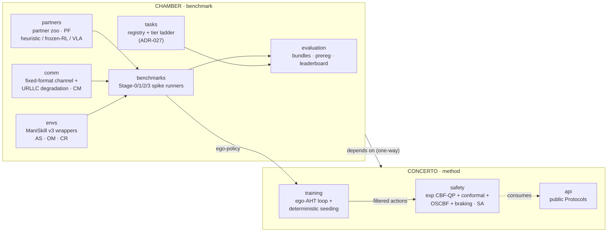

# Architecture at a glance

Two top-level packages, one wheel. CHAMBER (the benchmark) wraps
ManiSkill v3 and provides the heterogeneity-axis controls, the
communication stack, the partner zoo, the task registry, and the
evaluation harness. CONCERTO (the method) provides the safety stack
and the ego ad-hoc-teamwork training loop. The dependency direction is
one-way: `chamber → concerto`. Canonical sentence: *we evaluate
CONCERTO on CHAMBER.*



The axis labels (AS, OM, CR, CM, PF, SA) tie each module to the
heterogeneity sub-axis it exercises; see
[Positioning](positioning.md) for the axis table and the
coupling-validity rule that governs which axes may ship in the
benchmark.

## The safety stack (CONCERTO)

CONCERTO's safety module is a three-layer filter with a hard
backstop, applied to every ego action before it reaches the
simulator:

1. **Exponential control-barrier-function quadratic program**
   (`concerto.safety.cbf_qp`) — the outer filter
   (Wang, Ames & Egerstedt 2017).
2. **Conformal-slack overlay** (`concerto.safety.conformal`) — a
   distribution-free calibration layer that widens or tightens the
   barrier slack from observed violations (Huriot & Sibai 2025).
   Its guarantee is a long-term *average-loss* bound, not a per-step
   bound; sharpening this is the project's headline open theoretical
   question ([ADR-004](../reference/adrs.md)).
3. **Operational-space control-barrier-function inner filter**
   (`concerto.safety.oscbf`) — joint-space filtering at control rate
   (Morton & Pavone 2025).
4. **Hard braking fallback** (`concerto.safety.braking`) — the
   per-step backstop when the layers above cannot certify an action.

## Try the communication stack

Compose a factory-floor channel (a degradation profile anchored to
3GPP Release-17 ultra-reliable low-latency-communication figures) and
round-trip a packet through `encode → decode`:

```python
from chamber.comm import (
    CommDegradationWrapper,
    FixedFormatCommChannel,
    URLLC_3GPP_R17,
)

channel = CommDegradationWrapper(
    FixedFormatCommChannel(),
    URLLC_3GPP_R17["factory"],
    tick_period_ms=1.0,
    root_seed=0,
)

state = {
    "pose": {
        "ego": {"xyz": (0.0, 0.0, 0.0), "quat_wxyz": (1.0, 0.0, 0.0, 0.0)},
    },
    "task_state": {"ego": {"grasp_side": "left"}},
}

# The factory profile delays each packet by ~5 ticks; drain the queue so
# the visible packet carries the freshly-encoded state.
for _ in range(10):
    packet = channel.encode(state)
decoded = channel.decode(packet)
print("decoded payload:", decoded)
```

Save the snippet to `quickstart.py` and run
`uv run python quickstart.py`. The six preregistered profiles —
`ideal`, `urllc`, `factory`, `wifi`, `lossy`, `saturation` — are the
Stage-2 communication sweep table (ADR-003, ADR-006).

## Repository layout

```text
src/
├── concerto/      # the METHOD  (cite this)
│   ├── safety/    #   exp CBF-QP + conformal overlay + OSCBF + braking fallback
│   ├── training/  #   ego-AHT training loop + deterministic seeding
│   ├── policies/  #   Phase-1 trained checkpoints
│   └── api/       #   public Protocols
└── chamber/       # the BENCHMARK  (run this)
    ├── envs/      #   ManiSkill v3 wrappers
    ├── comm/      #   fixed-format channel + URLLC degradation
    ├── partners/  #   partner zoo (heuristic / frozen-RL / VLA stubs)
    ├── tasks/     #   task registry + tier ladder (ADR-027; single source of truth)
    ├── evaluation/#   result bundles, pre-registration, leaderboard renderer
    └── benchmarks/#   Stage-0/1/2/3 spike runners

adr/               # Architecture Decision Records (the design rationale)
docs/              # Diátaxis: tutorials / how-to / reference / explanation
tests/             # unit / property / integration / smoke / reproduction
spikes/            # pre-registration YAMLs + immutable result archives
```

## Stability and versioning

The project follows [Semantic Versioning](https://semver.org/). Under
`0.x`, MINOR-version bumps may break the public API per SemVer §4.
The public API surfaces are `concerto.api`, `concerto.safety.api`,
and `chamber.comm`; everything else is implementation detail. Two
constants are load-bearing and require a new ADR to change: the
wire-format `chamber.comm.SCHEMA_VERSION` (the fixed-format packet
shape) and the result-bundle
`chamber.evaluation.results.SCHEMA_VERSION`
([ADR-028](../reference/adrs.md)). Benchmark tasks and partner sets
are versioned separately from the package and are never mutated in
place — see [MAINTENANCE.md](https://github.com/fsafaei/concerto/blob/main/MAINTENANCE.md).

## Observability

Weights & Biases dashboards are opt-in; the canonical record is
always the per-cell JSONL archive, and runs without W&B credentials
complete with valid records (ADR-017). The read-only
`chamber-analyze` CLI compares runs and dumps per-step rollout frames
offline. Full cookbook: [Observability](../observability.md).
