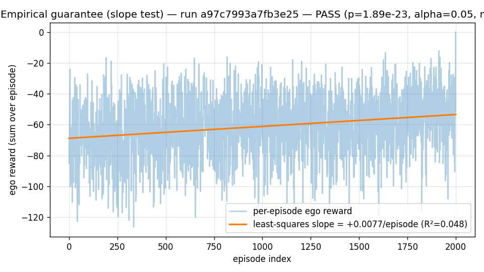

# Why heterogeneous ad-hoc teamwork?

Most multi-robot manipulation benchmarks assume identical embodiments and
shared training. Real-world deployment — hospital logistics, disaster response,
factory retooling — routinely pairs robots with incompatible action spaces,
differing sensor modalities, and no shared policy checkpoints.

CONCERTO and CHAMBER focus on the hardest variant of this problem: the
ego agent's partner is **opaque** (no policy access), **heterogeneous**
(different morphology and action frequency), and **ad-hoc** (no prior
joint training). The six axes that make this hard are: action-space
heterogeneity (AS), observation-modality heterogeneity (OM), control-rate
mismatch (CR), communication degradation (CM), partner familiarity
(PF), and safety (SA). See [ADR-007](../reference/adrs.md) for the axis
selection rationale and staging plan.

The four named precedents CONCERTO differentiates against — Liu 2024
RSS, COHERENT, Huriot-Sibai 2025, and Singh 2024 — each solve a subset
of these axes. No prior system addresses all six simultaneously.

## Why ego-PPO under a frozen partner?

[ADR-002][adr-002] selects on-policy PPO as the Phase-0 ego training
substrate. The reasoning is theoretical: when the partner's policy is
*frozen*, the multi-agent task degenerates to a single-agent MDP from
the ego's perspective — the partner's actions are part of the
transition kernel, not the ego's gradient. Huriot-Sibai 2025 Theorem 7
states that ego-only PPO is then monotone-improving in expectation,
which is the strongest theoretical guarantee available for this setting.

The empirical-guarantee experiment ([M4b-8b][plan-05]) verifies that
guarantee holds in practice on a real env at the project's frame
budget. The 100k-frame ego-AHT HAPPO run against
`configs/training/ego_aht_happo/mpe_cooperative_push.yaml` — a 2-agent
cooperative-coverage task in the spirit of PettingZoo's
`simple_spread_v3`, with a scripted heuristic partner — produces this
reward curve:



The plotted line is the least-squares regression on per-episode reward
against episode index. The trainer drives an ~15-reward-unit positive
drift over the run (slope ≈ +0.0077/episode, p ≈ 2 × 10⁻²³ one-sided
against the null "slope ≤ 0"). Two methodology notes:

- **The statistic is a slope test, not a moving-window non-decreasing-
  fraction.** Per-episode reward stdev on this task is ~20, so adjacent
  moving-window-of-10 means form a near-zero-mean random walk that
  doesn't reflect the underlying learning signal. The slope test
  integrates over the whole curve and is robust to that noise. See
  [issue #62][issue-62] for the diagnostic walk-through that led to
  this replacement.
- **The trainer correctly handles time-limit truncation.** An earlier
  bug conflated time-limit truncation (`truncated=True,
  terminated=False`) with true termination, zeroing the GAE bootstrap
  value at every episode boundary on time-limit-only envs like the MPE
  cooperative-push task. The fix in
  [`compute_gae`][compute-gae] (per Pardo et al. 2018) bootstraps with
  V(s_truncated_final) at truncation boundaries, ~doubling the
  observed learning rate. See [PR #70][pr-70] for the empirical A/B
  comparison.

## What this validates

Three things, in order of certainty:

1. The ego-PPO substrate the project uses for Phase-0 does in fact
   produce a statistically significant positive learning signal on the
   frozen-partner task within the budget. The trip-wire was designed
   to be loud if this failed; it currently passes with very wide
   margin.
2. The trainer's GAE math, importance-ratio reduction, and rollout
   buffer correctness are all consistent with single-agent PPO on the
   same buffered `(rewards, values, next_values, boundaries)` tuples,
   per the property test at
   `tests/property/test_advantage_decomposition.py`. So the experiment
   isn't measuring trainer wiring; it's measuring algorithm/task fit.
3. The 100k-frame budget is *sufficient* for the positive-slope signal
   to dominate noise. It is **not** sufficient for the policy to reach
   the greedy-oracle ceiling on this task (eval at step 100k is roughly
   -50; the greedy-nearest-landmark oracle achieves -41). Closing that
   gap is a separate scaling question outside Phase-0's scope.

## What this does NOT claim

The empirical-guarantee experiment is a *necessary*-condition trip-
wire, not a sufficient one. A passing slope test does not imply:

- That the trainer would still learn under a non-frozen partner (joint
  training is out of scope for ADR-002).
- That the chosen hyperparameters are optimal.
- That the same setup will produce learning on harder tasks (Stage 1/2/3
  spikes, per ADR-007).

If the trip-wire ever fails on the production config — fraction or
slope, depending on which statistic is canonical at the time — the
project stops and revisits ADR-002, per the escalation policy in
plan/05 §6.

## Reproduce locally

The full reproduction lives in
[`scripts/repro/empirical_guarantee.sh`][repro-script] and runs via:

```shell
make empirical-guarantee
```

It runs `pytest -m slow tests/integration/test_empirical_guarantee.py`
against the production YAML, prints the device report, and exits
non-zero if either the wallclock budget is exceeded or the slope test
trip-wire fires. Total CPU wall-time is ~10 seconds on a modern
laptop.

[adr-002]: ../reference/adrs.md
[plan-05]: ../reference/api.md
[issue-62]: https://github.com/fsafaei/concerto/issues/62
[pr-70]: https://github.com/fsafaei/concerto/pull/70
[compute-gae]: ../reference/api.md
[repro-script]: https://github.com/fsafaei/concerto/blob/main/scripts/repro/empirical_guarantee.sh
