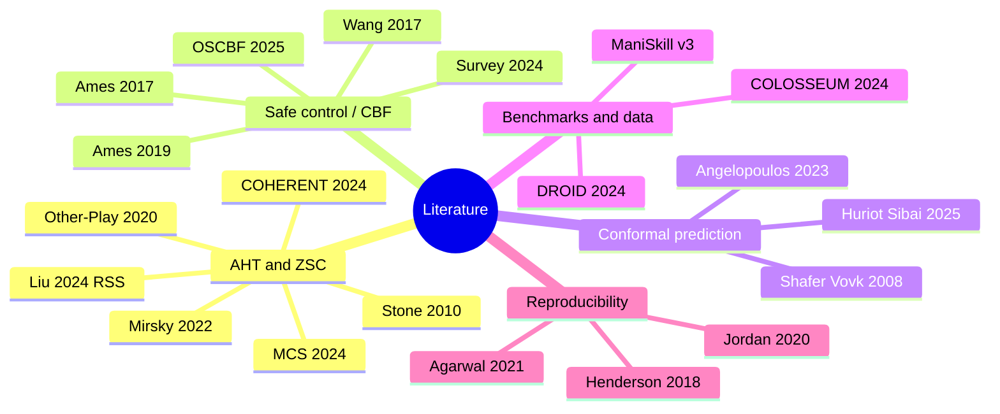

# Literature

CONCERTO and CHAMBER build on three tiers of external evidence:
**(a) peer-reviewed publications**, **(b) standards and technical
specifications**, and **(c) industry signal and horizon-scanning
material**. The three tiers are kept separate because they have
different evidentiary weight and different update cadences. Tier (a)
— the peer-reviewed bibliography below — anchors the method's
theoretical claims. Tier (b) lives in
[`standards.md`](standards.md): binding standards (ISO, IEC, IEEE,
3GPP) that bound what "safe" and "deterministic" mean in deployment.
Tier (c) lives in
[`adr/international_axis_evidence.md`](https://github.com/fsafaei/concerto/blob/main/adr/international_axis_evidence.md):
deployment signal (humanoid factory pilots, logistics fleets, surgical
robotics) used as a prior on which heterogeneity axes are commercially
load-bearing, but never as a substitute for the empirical ≥20pp gap
rule (see [`ADR-007 §Validation criteria`](https://github.com/fsafaei/concerto/blob/main/adr/ADR-007-heterogeneity-axis-selection.md)).
This page covers tier (a) only.

> Every entry below carries a BibTeX cite-key in square brackets
> matching the canonical [`docs/reference/refs.bib`](refs.bib) file.
> Cite by key from public docs and ADRs; do not introduce a citation
> without adding it to `refs.bib` first. See
> [CONTRIBUTING.md § Bibliography hygiene](https://github.com/fsafaei/concerto/blob/main/CONTRIBUTING.md#bibliography-hygiene)
> for the maintainer checklist.

## Taxonomy

The five clusters below each open with a two-paragraph note locating
the cited work relative to CONCERTO's claims, followed by the
bibliography itself: one bullet per work, prefixed with its
code-spanned [`bibkey`] from
[`docs/reference/refs.bib`](refs.bib). Where a citation also appears
in an existing ADR, the ADR reference is given inline.

---

## 1. Ad hoc teamwork and zero-shot coordination

Ad hoc teamwork (AHT) and zero-shot coordination (ZSC) define the
problem CONCERTO is built to solve: an ego agent must cooperate with
partners whose policies, training history, and internal state are
opaque at deployment time. Stone et al. (2010) [`stone2010adhoc`]
coined the AHT formalism; Mirsky et al. (2022) [`mirsky2022survey`]
survey a decade of subsequent work and expose the under-explored
manipulation tier that CHAMBER is built to fill. Hu et al. (2020)
[`hu2020otherplay`] introduce other-play as the first principled ZSC
method, and Rahman et al. (2024) [`rahman2024mcs`] sharpen partner-set
construction with Minimum Coverage Sets — the formal counterpart to
the entropy-filtered partner zoo specified in
[`ADR-009`](https://github.com/fsafaei/concerto/blob/main/adr/ADR-009-partner-zoo.md).

Liu et al. (2024) [`liu2024llm_aht`] and COHERENT (Liu et al. 2024)
[`coherent2024`] are the two closest precedents to CONCERTO on the
*heterogeneous, black-box partner* axes. Both stop short of
contact-rich manipulation with a formal safety bound; the
CONCERTO-vs-precedents table in the project README makes the
differentiation explicit. They are listed here for completeness so
this page can stand alone as the literature reference.

- **[`stone2010adhoc`]** Stone, Kaminka, Kraus, Rosenschein (2010),
  "Ad Hoc Autonomous Agent Teams: Collaboration without
  Pre-Coordination," AAAI.
  [paper](https://ojs.aaai.org/index.php/AAAI/article/view/7529)
- **[`mirsky2022survey`]** Mirsky, Carlucho, Rahman, Fosong, Macke,
  Sridharan, Stone, Albrecht (2022), "A Survey of Ad Hoc Teamwork
  Research," EUMAS.
  [paper](https://arxiv.org/abs/2202.10450)
- **[`hu2020otherplay`]** Hu, Lerer, Peysakhovich, Foerster (2020),
  "'Other-Play' for Zero-Shot Coordination," ICML.
  [paper](https://arxiv.org/abs/2003.02979)
- **[`rahman2024mcs`]** Rahman, Cui, Stone (2024), "Minimum Coverage
  Sets for Training Robust Ad Hoc Teamwork Agents," AAAI.
  [paper](https://arxiv.org/abs/2308.09595)
- **[`liu2024llm_aht`]** Liu, Stella, Stone (2024), "LLM-Powered
  Hierarchical Language Agent for Real-time Human-AI Coordination,"
  RSS. Cited throughout the CONCERTO ADRs as "Liu 2024 RSS".
- **[`coherent2024`]** Liu, Tang, Wang, Wang, Zhao, Li (2024),
  "COHERENT: Collaboration of Heterogeneous Multi-Robot Systems with
  Large Language Models," arXiv:2409.15146.
  [paper](https://arxiv.org/abs/2409.15146)

---

## 2. Safe control and control barrier functions

Control barrier functions (CBFs) underwrite CONCERTO's safety claim.
Ames et al. (2017) [`ames2017cbfqp`] is the canonical CBF-QP paper
and the right starting point for any reader new to the formalism;
Ames et al. (2019) [`ames2019cbfsurvey`] is the broader
theory-and-applications survey that catalogues exponential,
high-relative-degree, and discrete-time extensions used throughout
[`ADR-004`](https://github.com/fsafaei/concerto/blob/main/adr/ADR-004-safety-filter.md).
Wang, Ames, and Egerstedt (2017) [`wangames2017`] extend the CBF-QP
to multi-robot collision avoidance and are the direct ancestor of
the per-pair CBF budget split implemented in
`concerto.safety.budget_split`.

Morton and Pavone (2025) [`morton2025oscbf`] introduce the
operator-splitting CBF (OSCBF), which serves as CONCERTO's inner
per-arm filter, and Guerrier et al. (2024)
[`guerrier2024lcbfsurvey`] survey the rapidly growing learning-to-CBF
literature — useful when reading CONCERTO against the wider field
of safety-augmented reinforcement learning. The cross-cutting
multi-agent safety survey carried by ADR-004 / ADR-014 tier-2 note 45
is [`lindemann2024safety`].

- **[`ames2017cbfqp`]** Ames, Xu, Grizzle, Tabuada (2017), "Control
  Barrier Function Based Quadratic Programs for Safety Critical
  Systems," IEEE TAC 62(8):3861–3876.
  [paper](https://ieeexplore.ieee.org/document/7782377)
- **[`ames2019cbfsurvey`]** Ames, Coogan, Egerstedt, Notomista,
  Sreenath, Tabuada (2019), "Control Barrier Functions: Theory and
  Applications," ECC.
  [paper](https://ieeexplore.ieee.org/document/8796030)
- **[`wangames2017`]** Wang, Ames, Egerstedt (2017), "Safety Barrier
  Certificates for Collisions-Free Behaviors in Multirobot Systems,"
  IEEE CDC. The multi-robot CBF that the per-pair budget split in
  ADR-004 §6.2 generalises.
  [paper](https://ieeexplore.ieee.org/document/7989121)
- **[`morton2025oscbf`]** Morton, Pavone (2025), "Oblivious
  Safety-Critical Control via Operator-Splitting Quadratic Programs,"
  arXiv:2503.17678. OSCBF; CONCERTO's inner per-arm filter (see
  ADR-004 §5).
  [paper](https://arxiv.org/abs/2503.17678)
- **[`guerrier2024lcbfsurvey`]** Guerrier, Fouad, Beltrame (2024),
  "Learning Control Barrier Functions and their Application in
  Reinforcement Learning: A Survey," arXiv:2404.16879.
  [paper](https://arxiv.org/abs/2404.16879)
- **[`lindemann2024safety`]** Lindemann et al. (2024), "Formal
  Verification and Control with Conformal Prediction (and the Safety
  of Learning-Enabled Multi-Agent Systems): A Survey,"
  arXiv:2409.00536. The "Garg/Lindemann" safety survey carried by
  ADR-004 and ADR-014 tier-2 note 45.
  [paper](https://arxiv.org/abs/2409.00536)
- **[`ballotta2024aoi`]** Ballotta, Talak (2024), "Optimal Trade-Offs
  between Reliability and Freshness for Multi-Agent Decision Making
  with Age of Information," arXiv:2403.05757. Source for the AoI
  predictor pattern used in CHAMBER's degradation wrapper (ADR-003,
  ADR-008).
  [paper](https://arxiv.org/abs/2403.05757)
- **[`cavorsi2022`]** Cavorsi, Capelli, Sabattini, Gil (2022),
  "Multi-Robot Adversarial Resilience using Control Barrier
  Functions," RSS. Source for the nested-CBF degraded-partner budget
  template referenced by ADR-006 and ADR-008.

---

## 3. Conformal prediction and conformal control

Conformal prediction supplies the distribution-free coverage
guarantee that the conformal-slack overlay in
[`ADR-004 §6.1`](https://github.com/fsafaei/concerto/blob/main/adr/ADR-004-safety-filter.md)
inherits. Shafer and Vovk (2008) [`shafer2008conformal`] give the
original tutorial; the Angelopoulos and Bates (2023)
[`angelopoulos2023conformal`] Foundations and Trends monograph is the
modern textbook reference and the one to recommend to a reader new to
the subject.

Huriot and Sibai (2025) [`huriotsibai2025`] bridge conformal
prediction and CBF-based safety. Their Theorem 3 average-loss bound
is the theoretical anchor for CONCERTO's conformal overlay and is
also the project's biggest open question: whether the bound can be
sharpened from an average guarantee to a per-step one (deferred to a
follow-up ADR — see
[`ADR-014 §Open questions`](https://github.com/fsafaei/concerto/blob/main/adr/ADR-014-safety-reporting.md)).

- **[`shafer2008conformal`]** Shafer, Vovk (2008), "A Tutorial on
  Conformal Prediction," JMLR 9:371–421.
  [paper](https://www.jmlr.org/papers/v9/shafer08a.html)
- **[`angelopoulos2023conformal`]** Angelopoulos, Bates (2023),
  "Conformal Prediction: A Gentle Introduction," Foundations and
  Trends in Machine Learning 16(4):494–591.
  [paper](https://arxiv.org/abs/2107.07511)
- **[`huriotsibai2025`]** Huriot, Sibai (2025), "Conformal Control
  Barrier Functions for Safety under Distribution Shift,"
  arXiv:2409.18862. Theorem 3 (average-loss bound) underwrites the
  conformal-slack overlay in ADR-004 §6.1.
  [paper](https://arxiv.org/abs/2409.18862)

---

## 4. Benchmarks, data, and generalization

CHAMBER is a wrapper layer above ManiSkill v3 (Tao et al. 2024)
[`tao2024maniskill3`]; the wrapper-only discipline is captured in
[`ADR-001`](https://github.com/fsafaei/concerto/blob/main/adr/ADR-001-fork-vs-build.md)
and enforced by `tests/unit/test_no_private_imports.py`. BiGym
(Chernyadev et al. 2024) [`chernyadev2024bigym`], RoCoBench (Mandi
et al. 2024) [`mandi2024rocobench`], and SafeBimanual (Su et al.
2024) [`su2024safebimanual`] are the closest existing bimanual /
multi-arm benchmarks; their gap on the *Heterogeneity ×
Black-box-partner × Safety × Manipulation* intersection is the
reason CHAMBER exists.

THE COLOSSEUM (Pumacay et al. 2024) [`pumacay2024colosseum`] is the
closest precedent for *generalization-axis-perturbation* evaluation
in manipulation; its 14-axis perturbation matrix is methodologically
adjacent to CHAMBER's six-axis heterogeneity sweep, though it focuses
on visual / environmental perturbations rather than partner
heterogeneity. DROID (Khazatsky et al. 2024) [`khazatsky2024droid`]
is the large-scale in-the-wild manipulation dataset whose 564-scene
diversity informs CHAMBER's task-lattice selection.

- **[`tao2024maniskill3`]** Tao, Xiang, Shukla, Qin, Hinrichsen, Yuan,
  Bao, Lin, Liu, Chan, Gao, Li, Mu, Xiao, Gurha, Nagaswamy Rajesh,
  Choi, Chen, Huang, Calandra, Chen, Luo, Su (2024), "ManiSkill3: GPU
  Parallelized Robotics Simulation and Rendering for Generalizable
  Embodied AI," arXiv:2410.00425.
  [paper](https://arxiv.org/abs/2410.00425)
- **[`chernyadev2024bigym`]** Chernyadev, Backshall, Ma, Lu, Seo,
  James (2024), "BiGym: A Demo-Driven Mobile Bi-Manual Manipulation
  Benchmark," arXiv:2407.07788.
  [paper](https://arxiv.org/abs/2407.07788)
- **[`mandi2024rocobench`]** Mandi, Jain, Song (2024), "RoCo:
  Dialectic Multi-Robot Collaboration with Large Language Models,"
  IEEE ICRA.
  [paper](https://arxiv.org/abs/2307.04738)
- **[`su2024safebimanual`]** Su et al. (2024), "SafeBimanual:
  Diffusion-based Trajectory Optimization for Safe Bimanual
  Manipulation," arXiv:2508.18268.
  [paper](https://arxiv.org/abs/2508.18268)
- **[`pumacay2024colosseum`]** Pumacay, Singh, Duan, Krishna,
  Thomason, Fox (2024), "THE COLOSSEUM: A Benchmark for Evaluating
  Generalization for Robotic Manipulation," arXiv:2402.08191.
  [paper](https://arxiv.org/abs/2402.08191)
- **[`khazatsky2024droid`]** Khazatsky, Pertsch, Nair, et al. (2024),
  "DROID: A Large-Scale In-The-Wild Robot Manipulation Dataset," RSS.
  [paper](https://arxiv.org/abs/2403.12945)

---

## 5. Reproducibility and statistical evaluation

CHAMBER commits up-front to the reporting discipline these three
papers establish. Henderson et al. (2018) [`henderson2018matters`]
is the canonical cautionary tale for deep-RL evaluation: single-seed
bars, no confidence intervals, cherry-picked checkpoints, and
undocumented hyperparameter sweeps together make published results
non-reproducible. [`evaluation.md`](evaluation.md) lists the
specific anti-patterns CHAMBER refuses to fall into.

Agarwal et al. (2021) [`agarwal2021precipice`] introduce the rliable
library and a suite of robust aggregate metrics (IQM, optimality gap,
performance profiles) that are now standard in deep-RL reporting; the
CHAMBER leaderboard renderer emits these alongside the more
traditional mean ± 95% CI. Jordan et al. (2020)
[`jordan2020evaluating`] provide the underlying
evaluation-comparison framework — minimum detectable effect size at
a given sample size — that justifies the seed counts in
[`ADR-009 §Validation criteria`](https://github.com/fsafaei/concerto/blob/main/adr/ADR-009-partner-zoo.md).
Wilkinson et al. (2016) [`wilkinson2016fair`] supplies the FAIR
stewardship principles CHAMBER artifacts are released under (see
[`evaluation.md §3.4`](evaluation.md)).

- **[`henderson2018matters`]** Henderson, Islam, Bachman, Pineau,
  Precup, Meger (2018), "Deep Reinforcement Learning that Matters,"
  AAAI.
  [paper](https://arxiv.org/abs/1709.06560)
- **[`agarwal2021precipice`]** Agarwal, Schwarzer, Castro, Courville,
  Bellemare (2021), "Deep Reinforcement Learning at the Edge of the
  Statistical Precipice," NeurIPS. Introduces the rliable library.
  [paper](https://arxiv.org/abs/2108.13264)
- **[`jordan2020evaluating`]** Jordan, Chandak, Cohen, Zhang, Thomas
  (2020), "Evaluating the Performance of Reinforcement Learning
  Algorithms," ICML.
  [paper](https://arxiv.org/abs/2006.16958)
- **[`wilkinson2016fair`]** Wilkinson et al. (2016), "The FAIR
  Guiding Principles for Scientific Data Management and Stewardship,"
  Scientific Data 3:160018.
  [paper](https://www.nature.com/articles/sdata201618)
