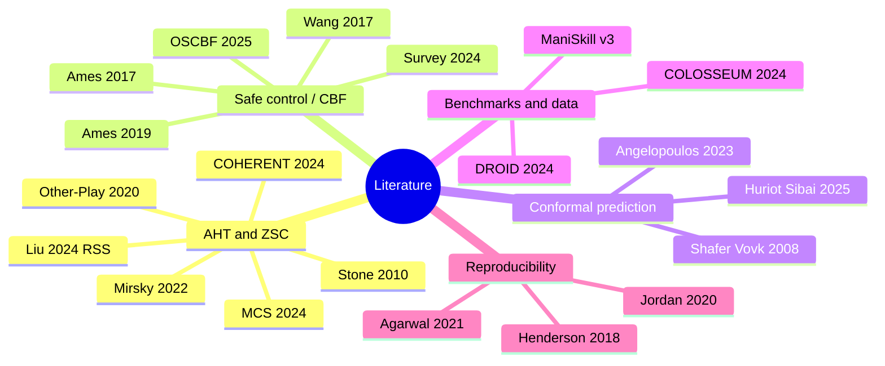

# Literature

CONCERTO and CHAMBER build on three tiers of external evidence:
**(a) peer-reviewed publications**, **(b) standards and technical
specifications**, and **(c) industry signal and horizon-scanning
material**. The three tiers are kept separate because they have
different evidentiary weight and different update cadences. Tier (a)
— the peer-reviewed bibliography below — anchors the method's
theoretical claims. Tier (b) lives in
[`standards.md`](standards.md): binding standards (ISO, IEC, IEEE,
3GPP) that bound what "safe" and "deterministic" mean in deployment.
Tier (c) lives in
[`adr/international_axis_evidence.md`](https://github.com/fsafaei/concerto/blob/main/adr/international_axis_evidence.md):
deployment signal (humanoid factory pilots, logistics fleets, surgical
robotics) used as a prior on which heterogeneity axes are commercially
load-bearing, but never as a substitute for the empirical ≥20pp gap
rule (see [`ADR-007 §Validation criteria`](https://github.com/fsafaei/concerto/blob/main/adr/ADR-007-heterogeneity-axis-selection.md)).
This page covers tier (a) only.

## Taxonomy



The five clusters below each open with a two-paragraph note locating
the cited work relative to CONCERTO's claims, followed by a
BibTeX-compatible bibliography block. Where a citation also appears
in an existing ADR, the ADR reference is given inline.

---

## 1. Ad hoc teamwork and zero-shot coordination

Ad hoc teamwork (AHT) and zero-shot coordination (ZSC) define the
problem CONCERTO is built to solve: an ego agent must cooperate with
partners whose policies, training history, and internal state are
opaque at deployment time. Stone et al. (2010) coined the AHT
formalism; Mirsky et al. (2022) survey a decade of subsequent work and
expose the under-explored manipulation tier that CHAMBER is built to
fill. Hu et al. (2020) introduce other-play as the first principled
ZSC method, and Rahman et al. (2024) sharpen partner-set construction
with Minimum Coverage Sets — the formal counterpart to the entropy-
filtered partner zoo specified in [`ADR-009`](https://github.com/fsafaei/concerto/blob/main/adr/ADR-009-partner-zoo.md).

Liu et al. (2024) and COHERENT (Liu et al. 2024) are the two
closest precedents to CONCERTO on the *heterogeneous, black-box
partner* axes. Both stop short of contact-rich manipulation with a
formal safety bound; the CONCERTO-vs-precedents table in the project
README makes the differentiation explicit. They are listed here for
completeness so this page can stand alone as the literature reference.

```bibtex
@inproceedings{stone2010adhoc,
  author    = {Peter Stone and Gal A. Kaminka and Sarit Kraus and
               Jeffrey S. Rosenschein},
  title     = {Ad Hoc Autonomous Agent Teams: Collaboration without
               Pre-Coordination},
  booktitle = {AAAI Conference on Artificial Intelligence},
  year      = {2010},
}

@inproceedings{mirsky2022aht_survey,
  author    = {Reuth Mirsky and Ignacio Carlucho and Arrasy Rahman
               and Elliot Fosong and William Macke and Mohan
               Sridharan and Peter Stone and Stefano V. Albrecht},
  title     = {A Survey of Ad Hoc Teamwork Research},
  booktitle = {European Conference on Multi-Agent Systems (EUMAS)},
  year      = {2022},
}

@inproceedings{hu2020otherplay,
  author    = {Hengyuan Hu and Adam Lerer and Alex Peysakhovich
               and Jakob Foerster},
  title     = {``Other-Play'' for Zero-Shot Coordination},
  booktitle = {International Conference on Machine Learning (ICML)},
  year      = {2020},
}

@inproceedings{rahman2024mcs,
  author    = {Arrasy Rahman and Jiaxun Cui and Peter Stone},
  title     = {Minimum Coverage Sets for Training Robust Ad Hoc
               Teamwork Agents},
  booktitle = {AAAI Conference on Artificial Intelligence},
  year      = {2024},
}

@inproceedings{liu2024llm_aht,
  author    = {Bo Liu and Gabriel Stella and Peter Stone},
  title     = {{LLM}-Powered Hierarchical Language Agent for Real-time
               Human-{AI} Coordination},
  booktitle = {Robotics: Science and Systems (RSS)},
  year      = {2024},
  note      = {Cited throughout the CONCERTO ADRs as ``Liu 2024 RSS''.},
}

@misc{coherent2024,
  author    = {Kehui Liu and Zixin Tang and Dong Wang and Zhigang Wang
               and Bin Zhao and Xuelong Li},
  title     = {{COHERENT}: Collaboration of Heterogeneous Multi-Robot
               Systems with Large Language Models},
  year      = {2024},
  note      = {Cited throughout the CONCERTO ADRs as ``COHERENT''.},
}
```

---

## 2. Safe control and control barrier functions

Control barrier functions (CBFs) underwrite CONCERTO's safety claim.
Ames et al. (2017) is the canonical CBF-QP paper and the right
starting point for any reader new to the formalism; Ames et al.
(2019) is the broader theory-and-applications survey that catalogues
exponential, high-relative-degree, and discrete-time extensions used
throughout [`ADR-004`](https://github.com/fsafaei/concerto/blob/main/adr/ADR-004-safety-filter.md).
Wang, Ames, and Egerstedt (2017) extend the CBF-QP to multi-robot
collision avoidance and are the direct ancestor of the per-pair CBF
budget split implemented in `concerto.safety.budget_split`.

Morton and Pavone (2025) introduce the operator-splitting CBF
(OSCBF), which serves as CONCERTO's inner per-arm filter, and
Guerrier et al. (2024) survey the rapidly growing learning-to-CBF
literature — useful when reading CONCERTO against the wider field
of safety-augmented reinforcement learning.

```bibtex
@article{ames2017cbf_qp,
  author  = {Aaron D. Ames and Xiangru Xu and Jessy W. Grizzle
             and Paulo Tabuada},
  title   = {Control Barrier Function Based Quadratic Programs for
             Safety Critical Systems},
  journal = {IEEE Transactions on Automatic Control},
  volume  = {62},
  number  = {8},
  pages   = {3861--3876},
  year    = {2017},
  note    = {The canonical CBF-QP reference.},
}

@inproceedings{ames2019cbf_survey,
  author    = {Aaron D. Ames and Samuel Coogan and Magnus Egerstedt
               and Gennaro Notomista and Koushil Sreenath and Paulo
               Tabuada},
  title     = {Control Barrier Functions: Theory and Applications},
  booktitle = {European Control Conference (ECC)},
  year      = {2019},
}

@inproceedings{wang2017multirobot_cbf,
  author    = {Li Wang and Aaron D. Ames and Magnus Egerstedt},
  title     = {Safety Barrier Certificates for Collisions-Free
               Behaviors in Multirobot Systems},
  booktitle = {IEEE Conference on Decision and Control (CDC)},
  year      = {2017},
  note      = {The multi-robot CBF that the per-pair budget split
                in ADR-004 \S6.2 generalises.},
}

@misc{morton2025oscbf,
  author       = {Daniel Morton and Marco Pavone},
  title        = {Oblivious Safety-Critical Control via
                  Operator-Splitting Quadratic Programs},
  year         = {2025},
  howpublished = {arXiv:2503.17678},
  note         = {OSCBF; CONCERTO's inner per-arm filter, see
                  ADR-004 \S5.},
}

@misc{guerrier2024lcbf_survey,
  author       = {Maeva Guerrier and Hassan Fouad and Giovanni Beltrame},
  title        = {Learning Control Barrier Functions and their
                  Application in Reinforcement Learning: A Survey},
  year         = {2024},
  howpublished = {arXiv:2404.16879},
}
```

---

## 3. Conformal prediction and conformal control

Conformal prediction supplies the distribution-free coverage
guarantee that the conformal-slack overlay in
[`ADR-004 §6.1`](https://github.com/fsafaei/concerto/blob/main/adr/ADR-004-safety-filter.md)
inherits. Shafer and Vovk (2008) give the original tutorial; the
Angelopoulos and Bates (2023) Foundations and Trends monograph is the
modern textbook reference and the one to recommend to a reader new to
the subject.

Huriot and Sibai (2025) bridge conformal prediction and CBF-based
safety. Their Theorem 3 average-loss bound is the theoretical anchor
for CONCERTO's conformal overlay and is also the project's biggest
open question: whether the bound can be sharpened from an average
guarantee to a per-step one (deferred to a follow-up ADR — see
[`ADR-014 §Open questions`](https://github.com/fsafaei/concerto/blob/main/adr/ADR-014-safety-reporting.md)).

```bibtex
@article{shafer2008conformal_tutorial,
  author  = {Glenn Shafer and Vladimir Vovk},
  title   = {A Tutorial on Conformal Prediction},
  journal = {Journal of Machine Learning Research},
  volume  = {9},
  pages   = {371--421},
  year    = {2008},
}

@article{angelopoulos2023conformal_intro,
  author  = {Anastasios N. Angelopoulos and Stephen Bates},
  title   = {Conformal Prediction: A Gentle Introduction},
  journal = {Foundations and Trends in Machine Learning},
  volume  = {16},
  number  = {4},
  pages   = {494--591},
  year    = {2023},
}

@misc{huriot2025conformal_cbf,
  author       = {Anne Huriot and Hussein Sibai},
  title        = {Conformal Control Barrier Functions for Safety
                  under Distribution Shift},
  year         = {2025},
  howpublished = {arXiv:2409.18862},
  note         = {Theorem 3 (average-loss bound) underwrites the
                  conformal-slack overlay in ADR-004 \S6.1.},
}
```

---

## 4. Benchmarks, data, and generalization

CHAMBER is a wrapper layer above ManiSkill v3 (Tao et al. 2024); the
wrapper-only discipline is captured in
[`ADR-001`](https://github.com/fsafaei/concerto/blob/main/adr/ADR-001-fork-vs-build.md)
and enforced by `tests/unit/test_no_private_imports.py`. BiGym
(Chernyadev et al. 2024), RoCoBench (Mandi et al. 2024), and
SafeBimanual (Su et al. 2024) are the closest existing bimanual /
multi-arm benchmarks; their gap on the *Heterogeneity ×
Black-box-partner × Safety × Manipulation* intersection is the
reason CHAMBER exists.

THE COLOSSEUM (Pumacay et al. 2024) is the closest precedent for
*generalization-axis-perturbation* evaluation in manipulation; its
14-axis perturbation matrix is methodologically adjacent to CHAMBER's
six-axis heterogeneity sweep, though it focuses on visual /
environmental perturbations rather than partner heterogeneity. DROID
(Khazatsky et al. 2024) is the large-scale in-the-wild manipulation
dataset whose 564-scene diversity informs CHAMBER's task-lattice
selection.

```bibtex
@misc{tao2024maniskill3,
  author       = {Stone Tao and Fanbo Xiang and Arth Shukla and
                  Yuzhe Qin and Xander Hinrichsen and Xiaodi Yuan
                  and Chen Bao and Xinsong Lin and Yulin Liu and
                  Tse-kai Chan and Yuan Gao and Xuanlin Li and
                  Tongzhou Mu and Nan Xiao and Arnav Gurha and
                  Viswesh Nagaswamy Rajesh and Yong Woo Choi and
                  Yen-Ru Chen and Zhiao Huang and Roberto Calandra
                  and Rui Chen and Shan Luo and Hao Su},
  title        = {{ManiSkill3}: GPU Parallelized Robotics Simulation
                  and Rendering for Generalizable Embodied {AI}},
  year         = {2024},
  howpublished = {arXiv:2410.00425},
}

@misc{chernyadev2024bigym,
  author       = {Nikita Chernyadev and Nicholas Backshall and
                  Xiao Ma and Yunfan Lu and Younggyo Seo and
                  Stephen James},
  title        = {{BiGym}: A Demo-Driven Mobile Bi-Manual
                  Manipulation Benchmark},
  year         = {2024},
  howpublished = {arXiv:2407.07788},
}

@inproceedings{mandi2024rocobench,
  author    = {Zhao Mandi and Shreeya Jain and Shuran Song},
  title     = {{RoCo}: Dialectic Multi-Robot Collaboration with Large
               Language Models},
  booktitle = {IEEE International Conference on Robotics and
               Automation (ICRA)},
  year      = {2024},
}

@misc{su2024safebimanual,
  author       = {Haoyuan Su and others},
  title        = {{SafeBimanual}: Diffusion-based Trajectory
                  Optimization for Safe Bimanual Manipulation},
  year         = {2024},
}

@misc{pumacay2024colosseum,
  author       = {Wilbert Pumacay and Ishika Singh and Jiafei Duan
                  and Ranjay Krishna and Jesse Thomason and Dieter
                  Fox},
  title        = {{THE COLOSSEUM}: A Benchmark for Evaluating
                  Generalization for Robotic Manipulation},
  year         = {2024},
  howpublished = {arXiv:2402.08191},
}

@inproceedings{khazatsky2024droid,
  author    = {Alexander Khazatsky and Karl Pertsch and
               Suraj Nair and others},
  title     = {{DROID}: A Large-Scale In-The-Wild Robot Manipulation
               Dataset},
  booktitle = {Robotics: Science and Systems (RSS)},
  year      = {2024},
}
```

---

## 5. Reproducibility and statistical evaluation

CHAMBER commits up-front to the reporting discipline these three
papers establish. Henderson et al. (2018) is the canonical
cautionary tale for deep-RL evaluation: single-seed bars, no
confidence intervals, cherry-picked checkpoints, and undocumented
hyperparameter sweeps together make published results
non-reproducible. [`evaluation.md`](evaluation.md) lists the
specific anti-patterns CHAMBER refuses to fall into.

Agarwal et al. (2021) introduce the rliable library and a suite of
robust aggregate metrics (IQM, optimality gap, performance profiles)
that are now standard in deep-RL reporting; the CHAMBER leaderboard
renderer emits these alongside the more traditional mean ± 95% CI.
Jordan et al. (2020) provide the underlying evaluation-comparison
framework — minimum detectable effect size at a given sample size —
that justifies the seed counts in [`ADR-009 §Validation criteria`](https://github.com/fsafaei/concerto/blob/main/adr/ADR-009-partner-zoo.md).

```bibtex
@inproceedings{henderson2018drl_matters,
  author    = {Peter Henderson and Riashat Islam and Philip Bachman
               and Joelle Pineau and Doina Precup and David Meger},
  title     = {Deep Reinforcement Learning that Matters},
  booktitle = {AAAI Conference on Artificial Intelligence},
  year      = {2018},
}

@inproceedings{agarwal2021rliable,
  author    = {Rishabh Agarwal and Max Schwarzer and Pablo Samuel
               Castro and Aaron Courville and Marc G. Bellemare},
  title     = {Deep Reinforcement Learning at the Edge of the
               Statistical Precipice},
  booktitle = {Advances in Neural Information Processing Systems
               (NeurIPS)},
  year      = {2021},
  note      = {Introduces the rliable library.},
}

@inproceedings{jordan2020evaluating_rl,
  author    = {Scott M. Jordan and Yash Chandak and Daniel Cohen
               and Mengxue Zhang and Philip S. Thomas},
  title     = {Evaluating the Performance of Reinforcement Learning
               Algorithms},
  booktitle = {International Conference on Machine Learning (ICML)},
  year      = {2020},
}
```
