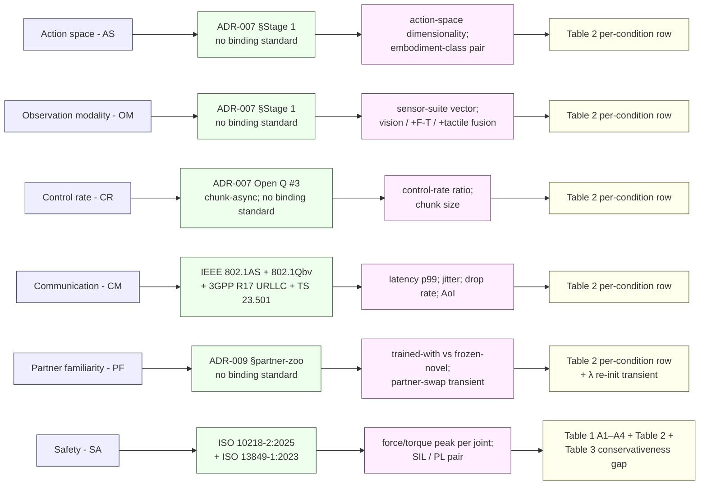

# Standards

This page lists the binding standards and technical specifications
CHAMBER and CONCERTO measure against. It is tier (b) in the
three-tier evidence convention described on the
[literature page](literature.md): peer-reviewed publications are tier
(a) and live in [`literature.md`](literature.md); industry signal
(humanoid factory pilots, logistics fleets, surgical robotics) is tier
(c) and lives in
[`adr/international_axis_evidence.md`](https://github.com/fsafaei/concerto/blob/main/adr/international_axis_evidence.md).

The standards below are grouped into two stacks — machine functional
safety and deterministic networking — followed by the
axis-to-standard-to-measurable-variable flowchart that ties each
[ADR-007](https://github.com/fsafaei/concerto/blob/main/adr/ADR-007-heterogeneity-axis-selection.md)
heterogeneity axis to its
[ADR-014](https://github.com/fsafaei/concerto/blob/main/adr/ADR-014-safety-reporting.md)
report-table column.

---

## 1. Machine functional safety

ISO 10218 parts 1 and 2 are the binding industrial-robot-safety
standard since their 2025 revision. The 2025 edition absorbs ISO/TS
15066:2016 (the original collaborative-robot technical specification
on biomechanical limits and force-pressure tables), making the limits
themselves part of a binding standard rather than a technical
specification. ISO 13849-1:2023 covers the safety-related parts of
control systems and assigns Performance Levels (PL `a`–`e`) based on
risk parameters (severity, frequency, avoidability). IEC 62061:2021
is the parallel functional-safety standard targeted at machinery and
its electrical / electronic / programmable-electronic control. The
two map onto the broader IEC 61508-1:2010 framework, which
establishes the Safety Integrity Level (SIL 1–4) hierarchy that ISO
13849 PL grades against.

CHAMBER references these standards directly. The Safety axis (SA)
in [ADR-007](https://github.com/fsafaei/concerto/blob/main/adr/ADR-007-heterogeneity-axis-selection.md)
varies *per-vendor compliance level* — heterogeneous force-limit and
SIL/PL pairs across simulated controllers — and the violation columns
in [ADR-014 Table 2](https://github.com/fsafaei/concerto/blob/main/adr/ADR-014-safety-reporting.md)
report against the ISO 10218-2:2025 biomechanical limits absorbed
from ISO/TS 15066. The standards do not certify simulation; they
define what the simulation must approximate to count as a faithful
proxy for compliance-relevant evaluation.

| Standard                | Title                                                                       | Edition / status     |
|-------------------------|-----------------------------------------------------------------------------|----------------------|
| ISO 10218-1:2025        | Robotics — Safety requirements — Part 1: Industrial robots                  | Binding, 2025        |
| ISO 10218-2:2025        | Robotics — Safety requirements — Part 2: Robot applications and integration | Binding, 2025        |
| ISO/TS 15066:2016       | Robots and robotic devices — Collaborative robots                           | Absorbed into 10218-2:2025 |
| ISO 13849-1:2023        | Safety of machinery — Safety-related parts of control systems — Part 1      | Binding              |
| IEC 62061:2021          | Safety of machinery — Functional safety of safety-related control systems   | Binding              |
| IEC 61508-1:2010        | Functional safety of E/E/PE safety-related systems — Part 1                 | Binding (SIL framework) |

---

## 2. Deterministic networking and 5G-TSN

CHAMBER's fixed-format communication channel
([`chamber.comm`](api.md)) is anchored to the IEEE Time-Sensitive
Networking (TSN) family and the 3GPP Release 17 URLLC profile. IEEE
802.1AS specifies generalised-precision time-synchronisation (the
profile of IEEE 1588 PTP used in TSN); IEEE 802.1Qbv defines
scheduled traffic via time-aware shaping; IEEE 802.1CB defines frame
replication and elimination for reliability (FRER) — used to obtain
seamless redundancy across redundant network paths. 3GPP Release 17
defines URLLC and the 5G system architecture that integrates a 5G
network as a virtual TSN bridge; 3GPP TS 23.501 is the canonical
5G-system-architecture spec and the entry point for the 5G-TSN
integration model. 5G-ACIA (5G Alliance for Connected Industries and
Automation) publishes the industry-side white papers that translate
3GPP and IEEE primitives into deployable factory configurations.

The six pre-registered URLLC profiles in `chamber.comm.URLLC_3GPP_R17`
(`ideal`, `urllc`, `factory`, `wifi`, `lossy`, `saturation`) are
parameterised against the numeric envelopes these standards define:
URLLC's 1 ms latency at 99.9999% reliability target, 802.1Qbv's
microsecond-grade scheduled-traffic jitter, and the factory-jitter
measurements reported in the 5G-TSN industrial trials (see the tier-c
evidence sweep linked above).

| Standard / spec         | Title / scope                                                               | Role in CHAMBER                          |
|-------------------------|-----------------------------------------------------------------------------|------------------------------------------|
| IEEE 802.1AS            | Timing and synchronisation for time-sensitive applications                  | Per-tick clock alignment in `chamber.comm` |
| IEEE 802.1Qbv           | Enhancements for scheduled traffic (time-aware shaping)                     | Anchors jitter bounds in URLLC profiles  |
| IEEE 802.1CB            | Frame replication and elimination for reliability (FRER)                    | Reference for the redundancy variant of the degradation wrapper |
| 3GPP Release 17 URLLC   | Ultra-reliable low-latency communication (1 ms p99 at 99.9999% reliability) | Numeric anchor for `URLLC_3GPP_R17`      |
| 3GPP TS 23.501          | System architecture for the 5G system; 5G-as-virtual-TSN-bridge model       | Integration model for the comm stack     |
| 5G-ACIA white papers    | 5G-TSN integration, industrial deployment patterns                          | Cross-check on factory-floor parameterisation |

---

## 3. Standards-and-measurement stack diagram

The flowchart below ties each
[ADR-007](https://github.com/fsafaei/concerto/blob/main/adr/ADR-007-heterogeneity-axis-selection.md)
heterogeneity axis to its governing standard (where one exists), to
the measurable benchmark variable CHAMBER exposes, and to the
[ADR-014](https://github.com/fsafaei/concerto/blob/main/adr/ADR-014-safety-reporting.md)
report-table column it populates. Where no binding standard applies,
the column points to the project's own anchoring document (ADR-007
implementation staging or ADR-009 partner-zoo construction).

Reading the diagram column by column:

- **Column (i): heterogeneity axis** — the six axes locked at
  [ADR-007 revision 3](https://github.com/fsafaei/concerto/blob/main/adr/ADR-007-heterogeneity-axis-selection.md).
- **Column (ii): governing standard or protocol** — the binding
  reference, where one exists. AS, OM, CR, and PF have no binding
  standard yet; their reference is the ADR section that pins the
  spike protocol. CM is fully covered by IEEE TSN + 3GPP. SA is
  covered by ISO 10218-2:2025 (which absorbs ISO/TS 15066:2016) and
  ISO 13849-1:2023.
- **Column (iii): measurable benchmark variable** — what CHAMBER
  records and reports. These are the variables the spike
  pre-registration YAMLs commit to before launch.
- **Column (iv): report-table column** — the
  [ADR-014](https://github.com/fsafaei/concerto/blob/main/adr/ADR-014-safety-reporting.md)
  three-table format. Table 1 is per-assumption violation rates;
  Table 2 is per-condition (predictor × conformal mode) rates; Table
  3 is conservativeness gap vs. oracle CBF. SA is the only axis
  that populates all three tables — A4 ("ISO 10218-2:2025 SIL/PL
  precondition satisfied") is added to Table 1 if the Stage 3 SA
  spike confirms the safety-axis decomposition deferred to
  [ADR-007 Open Question #4](https://github.com/fsafaei/concerto/blob/main/adr/ADR-007-heterogeneity-axis-selection.md).
