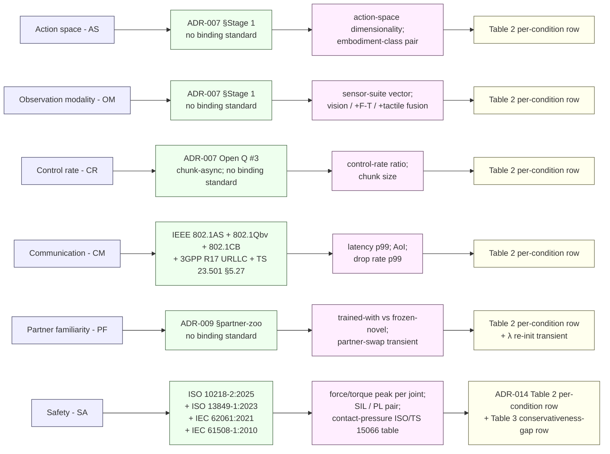

# Standards

This page lists the binding standards and technical specifications
CHAMBER and CONCERTO measure against. It is tier (b) in the
three-tier evidence convention described on the
[literature page](literature.md): peer-reviewed publications are tier
(a) and live in [`literature.md`](literature.md); industry signal
(humanoid factory pilots, logistics fleets, surgical robotics) is tier
(c) and lives in
[`adr/international_axis_evidence.md`](https://github.com/fsafaei/concerto/blob/main/adr/international_axis_evidence.md).

The standards below are grouped into two stacks — machine functional
safety and deterministic networking — followed by the
axis-to-standard-to-measurable-variable flowchart that ties each
[ADR-007](https://github.com/fsafaei/concerto/blob/main/adr/ADR-007-heterogeneity-axis-selection.md)
heterogeneity axis to its
[ADR-014](https://github.com/fsafaei/concerto/blob/main/adr/ADR-014-safety-reporting.md)
report-table column.

---

## 1. Machine functional safety

ISO 10218 parts 1 and 2 are the binding industrial-robot-safety
standard since their 2025 revision. The 2025 edition absorbs ISO/TS
15066:2016 (the original collaborative-robot technical specification
on biomechanical limits and force-pressure tables), making the limits
themselves part of a binding standard rather than a technical
specification. ISO 13849-1:2023 covers the safety-related parts of
control systems and assigns Performance Levels (PL `a`–`e`) based on
risk parameters (severity, frequency, avoidability). IEC 62061:2021
is the parallel functional-safety standard targeted at machinery and
its electrical / electronic / programmable-electronic control. The
two map onto the broader IEC 61508-1:2010 framework, which
establishes the Safety Integrity Level (SIL 1–4) hierarchy that ISO
13849 PL grades against.

CHAMBER references these standards directly. The Safety axis (SA)
in [ADR-007](https://github.com/fsafaei/concerto/blob/main/adr/ADR-007-heterogeneity-axis-selection.md)
varies *per-vendor compliance level* — heterogeneous force-limit and
SIL/PL pairs across simulated controllers — and the violation columns
in [ADR-014 Table 2](https://github.com/fsafaei/concerto/blob/main/adr/ADR-014-safety-reporting.md)
report against the ISO 10218-2:2025 biomechanical limits absorbed
from ISO/TS 15066. The standards do not certify simulation; they
define what the simulation must approximate to count as a faithful
proxy for compliance-relevant evaluation.

| Standard                | Title                                                                       | Edition / status     |
|-------------------------|-----------------------------------------------------------------------------|----------------------|
| ISO 10218-1:2025        | Robotics — Safety requirements — Part 1: Industrial robots                  | Binding, 2025        |
| ISO 10218-2:2025        | Robotics — Safety requirements — Part 2: Robot applications and integration | Binding, 2025        |
| ISO/TS 15066:2016       | Robots and robotic devices — Collaborative robots                           | Absorbed into 10218-2:2025 |
| ISO 13849-1:2023        | Safety of machinery — Safety-related parts of control systems — Part 1      | Binding              |
| IEC 62061:2021          | Safety of machinery — Functional safety of safety-related control systems   | Binding              |
| IEC 61508-1:2010        | Functional safety of E/E/PE safety-related systems — Part 1                 | Binding (SIL framework) |

### ISO 13849-1:2023

ISO 13849-1:2023 specifies the design and integration of the
safety-related parts of a machine's control system (SRP/CS). It
normatively requires that each safety function be assigned a required
Performance Level (PL `a`..`e`) derived from a risk graph over severity
of injury, frequency / duration of exposure, and possibility of
avoidance; the realised PL is then verified against the required PL
using a categorical architecture (Categories B, 1, 2, 3, 4) that
constrains structural redundancy, diagnostic coverage, and resistance
to common-cause failures. The standard is the dominant claim path used
by collaborative-robot integrators when arguing the safety-rated
monitored-stop and power-and-force-limiting functions called out by
ISO 10218-2:2025 §5. In CHAMBER, ISO 13849-1:2023 maps onto the SA-axis
*PL* component of the per-vendor SIL/PL pair: a simulated controller's
PL rating is one half of the vendor-compliance label that populates
the ADR-014 Table 2 per-condition row when ADR-007 Open Q #4 resolves
toward axis decomposition.

### IEC 62061:2021

IEC 62061:2021 is the machinery-sector application of the IEC 61508
functional-safety framework to safety-related electrical, electronic,
and programmable-electronic (E/E/PE) control systems. It normatively
requires that each safety function be assigned a required Safety
Integrity Level (SIL 1..3 for machinery — SIL 4 is out of scope for
this standard), with the SIL derived from a tolerable risk argument
over severity, frequency, probability of occurrence, and probability
of avoidance; the realised SIL is then verified against systematic
capability requirements and a quantitative target failure measure
(PFH for high-demand mode). IEC 62061 is the parallel claim path to
ISO 13849-1: an integrator may certify a safety function under either
or both, and the two are explicitly cross-mappable. In CHAMBER,
IEC 62061:2021 maps onto the SA-axis *SIL* component of the per-vendor
SIL/PL pair and is the source of the SIL labels reported alongside
PL grades in the ADR-014 Table 2 vendor-compliance rows.

### IEC 61508-1:2010

IEC 61508-1:2010 is the cross-sector functional-safety standard for
E/E/PE safety-related systems, from which both ISO 13849-1's PL
framework and IEC 62061's machinery-SIL framework are derived. It
normatively defines the Safety Integrity Level (SIL 1..4) hierarchy
in terms of probability of dangerous failure per hour (PFH) and
average probability of failure on demand (PFD), and it fixes the
overall safety-lifecycle process: hazard and risk analysis, safety
requirements specification, design, integration, validation, operation,
and modification. The standard does not bind a specific industry, but
its SIL semantics are the conceptual anchor that gives both PL grades
and machinery SIL grades a common interpretation. In CHAMBER, IEC
61508-1:2010 is the upstream reference for the per-vendor SIL/PL pair
reported by the SA axis and for the assumption-row label
"ISO 10218-2:2025 SIL/PL precondition satisfied" that ADR-014 Table 1
adds (as A4) if the safety axis decomposes.

---

## 2. Deterministic networking and 5G-TSN

CHAMBER's fixed-format communication channel
([`chamber.comm`](api.md)) is anchored to the IEEE Time-Sensitive
Networking (TSN) family and the 3GPP Release 17 URLLC profile. IEEE
802.1AS specifies generalised-precision time-synchronisation (the
profile of IEEE 1588 PTP used in TSN); IEEE 802.1Qbv defines
scheduled traffic via time-aware shaping; IEEE 802.1CB defines frame
replication and elimination for reliability (FRER) — used to obtain
seamless redundancy across redundant network paths. 3GPP Release 17
defines URLLC and the 5G system architecture that integrates a 5G
network as a virtual TSN bridge; 3GPP TS 23.501 is the canonical
5G-system-architecture spec and the entry point for the 5G-TSN
integration model. 5G-ACIA (5G Alliance for Connected Industries and
Automation) publishes the industry-side white papers that translate
3GPP and IEEE primitives into deployable factory configurations.

The six pre-registered URLLC profiles in `chamber.comm.URLLC_3GPP_R17`
(`ideal`, `urllc`, `factory`, `wifi`, `lossy`, `saturation`) are
parameterised against the numeric envelopes these standards define:
URLLC's 1 ms latency at 99.9999% reliability target, 802.1Qbv's
microsecond-grade scheduled-traffic jitter, and the factory-jitter
measurements reported in the 5G-TSN industrial trials (see the tier-c
evidence sweep linked above).

| Standard / spec         | Title / scope                                                               | Role in CHAMBER                          |
|-------------------------|-----------------------------------------------------------------------------|------------------------------------------|
| IEEE 802.1AS            | Timing and synchronisation for time-sensitive applications                  | Per-tick clock alignment in `chamber.comm` |
| IEEE 802.1Qbv           | Enhancements for scheduled traffic (time-aware shaping)                     | Anchors jitter bounds in URLLC profiles  |
| IEEE 802.1CB            | Frame replication and elimination for reliability (FRER)                    | Reference for the redundancy variant of the degradation wrapper |
| 3GPP Release 17 URLLC   | Ultra-reliable low-latency communication (1 ms p99 at 99.9999% reliability) | Numeric anchor for `URLLC_3GPP_R17`      |
| 3GPP TS 23.501          | System architecture for the 5G system; 5G-as-virtual-TSN-bridge model       | Integration model for the comm stack     |
| 5G-ACIA white papers    | 5G-TSN integration, industrial deployment patterns                          | Cross-check on factory-floor parameterisation |

### IEEE 802.1AS

IEEE 802.1AS specifies the generalised precision time protocol (gPTP),
the profile of IEEE 1588 PTPv2 used inside time-sensitive networks. A
conformant bridge propagates timing information end-to-end through a
master-slave hierarchy elected by the best-master-clock algorithm
(BMCA), and the standard normatively requires that path delay and
residence time at each hop be measured and corrected so that
participating end-stations share a common time reference accurate to
sub-microsecond on a single-segment factory deployment. CHAMBER's
fixed-format channel reads AoI timestamps against this assumed
shared time-base: without an 802.1AS-grade primitive, AoI is not
comparable across agents, and the conformal prediction layer's
input is no longer well-defined.

### IEEE 802.1Qbv

IEEE 802.1Qbv defines time-aware scheduled traffic via gate control
lists (GCLs) at every bridge output port. Each traffic class is
assigned an open transmission window inside a repeating cycle, and
the bridge normatively guarantees that frames belonging to a
scheduled class are forwarded only during their window, free of
contention from best-effort traffic. The standard's guarantees apply
to per-class p99 latency and to microsecond-grade jitter under
deterministic load. CHAMBER's URLLC degradation profiles
(`chamber.comm.URLLC_3GPP_R17`) treat the 802.1Qbv jitter envelope as
the floor of what a real 5G-TSN deployment can sustain — the
`urllc` and `factory` profiles parameterise jitter against this
floor; the `wifi` and `saturation` profiles deliberately violate it
to model commodity wireless and overloaded fabrics.

### IEEE 802.1CB

IEEE 802.1CB defines frame replication and elimination for reliability
(FRER). Each protected stream is sequence-numbered at ingress,
replicated onto multiple disjoint paths through the network, and
de-duplicated at the egress so that a single-path failure causes no
frame loss as observed by the receiver. The standard normatively
requires per-stream sequence-recovery state, a bounded
sequence-recovery window, and consistent stream identification across
replication points. CHAMBER references 802.1CB as the formal
template for a redundancy variant of the comm-degradation wrapper:
the wrapper can compose any saturation or drop profile with a
configurable FRER overlay that masks single-path losses up to a
bound, letting the Stage 2 CM spike isolate whether observed
violations are intrinsic to the stream or recoverable by redundancy.

### 3GPP TS 23.501 §5.27

3GPP TS 23.501 is the canonical 5G-system-architecture specification;
§5.27 covers the integration of the 5G system with deterministic
networking. The 5G system is exposed to the TSN domain as a single
virtual TSN bridge fronted by two translator functions: a device-side
TT (DS-TT) co-located with the UE and a network-side TT (NW-TT)
co-located with the UPF. The clause normatively requires that QoS,
scheduling, and time-synchronisation primitives be mapped
transparently between TSN streams and 5G QoS flows, so that an
end-to-end deterministic stream can cross the 5G radio segment
without losing its TSN guarantees. In CHAMBER, the URLLC profiles
represent the over-the-air segment within this end-to-end model;
the AoI timestamp seen at the receiver is the composition of the
DS-TT-side enqueue time, the radio segment, and the NW-TT-side
release.

### 5G-ACIA 5G-TSN integration white paper

The 5G Alliance for Connected Industries and Automation (5G-ACIA)
publishes the industry-side white papers that translate the 3GPP TS
23.501 §5.27 integration model and the IEEE 802.1 TSN family into
deployable factory-floor configurations. The white papers specify
deployment patterns (single-DS-TT, multi-DS-TT, redundancy
combinations), parameter ranges measured from industrial trials, and
reference architectures for time-sensitive control loops over 5G.
They are not binding standards in the IEEE / 3GPP sense, but they
are the de facto industry reference for what numeric envelopes are
actually achievable on the factory floor. CHAMBER's six URLLC
profiles cross-check their numeric envelopes against the 5G-ACIA
factory parameterisation; deviations are documented in the
profile-level comments in `chamber.comm.URLLC_3GPP_R17`.

---

## 3. Standards-and-measurement stack diagram

The flowchart below ties each
[ADR-007](https://github.com/fsafaei/concerto/blob/main/adr/ADR-007-heterogeneity-axis-selection.md)
heterogeneity axis to its governing standard (where one exists), to
the measurable benchmark variable CHAMBER exposes, and to the
[ADR-014](https://github.com/fsafaei/concerto/blob/main/adr/ADR-014-safety-reporting.md)
report-table column it populates. Where no binding standard applies,
the column points to the project's own anchoring document (ADR-007
implementation staging or ADR-009 partner-zoo construction).

Reading the diagram column by column:

- **Column (i): heterogeneity axis** — the six axes locked at
  [ADR-007 revision 3](https://github.com/fsafaei/concerto/blob/main/adr/ADR-007-heterogeneity-axis-selection.md).
- **Column (ii): governing standard or protocol** — the binding
  reference, where one exists. AS, OM, CR, and PF have no binding
  standard yet; their reference is the ADR section that pins the
  spike protocol. CM is fully covered by IEEE TSN + 3GPP. SA is
  covered by ISO 10218-2:2025 (which absorbs ISO/TS 15066:2016),
  ISO 13849-1:2023, IEC 62061:2021, and IEC 61508-1:2010 — the
  three machine-functional-safety standards underneath ISO 10218-2
  that fix the PL and SIL semantics of the per-vendor compliance
  pair.
- **Column (iii): measurable benchmark variable** — what CHAMBER
  records and reports. These are the variables the spike
  pre-registration YAMLs commit to before launch.
- **Column (iv): report-table column** — the
  [ADR-014](https://github.com/fsafaei/concerto/blob/main/adr/ADR-014-safety-reporting.md)
  three-table format. Table 1 is per-assumption violation rates;
  Table 2 is per-condition (predictor × conformal mode) rates; Table
  3 is conservativeness gap vs. oracle CBF. The SA row populates the
  Table 2 per-condition row and the Table 3 conservativeness-gap
  row; if the Stage 3 SA spike confirms the safety-axis decomposition
  deferred to
  [ADR-007 Open Question #4](https://github.com/fsafaei/concerto/blob/main/adr/ADR-007-heterogeneity-axis-selection.md),
  Table 1 additionally gains an A4 row labelled "ISO 10218-2:2025
  SIL/PL precondition satisfied" whose SIL/PL semantics are fixed by
  IEC 61508-1:2010 and claimed under ISO 13849-1:2023 / IEC 62061:2021.
